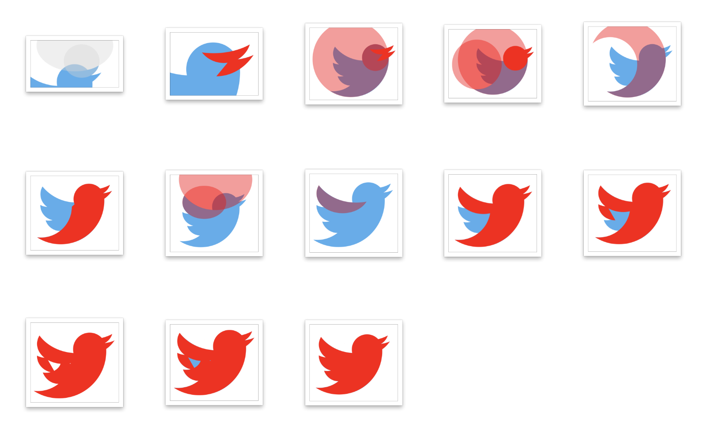

# Day 2

This time I recreated the Twitter logo from scratch using geometric shapes.

This technique favors the use of large defining shapes to outline the basic structure of a logo. This can also be done on a rough pencil sketch or no reference material at all.

Last time I simply traced the logo based on the original with vector points, which is fine, but it can lead to disproportionate shapes. It's much cleaner to use perfect shapes as a foundation and gradually sculpt the final product around those primitive shapes.

The blue logo is the original Twitter logo which I'm using as a reference, and the red one is my end product.

The entire process involved only a handful of Sketch techniques: the oval tool, boolean operators like subtract to carve out shapes, and the scissor tool for slicing off unnecessary bits.

95% of the logo is sculpted out of oval shapes. The remaining 5% are just vector extensions to cover up the empty spaces.

