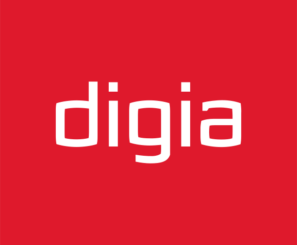
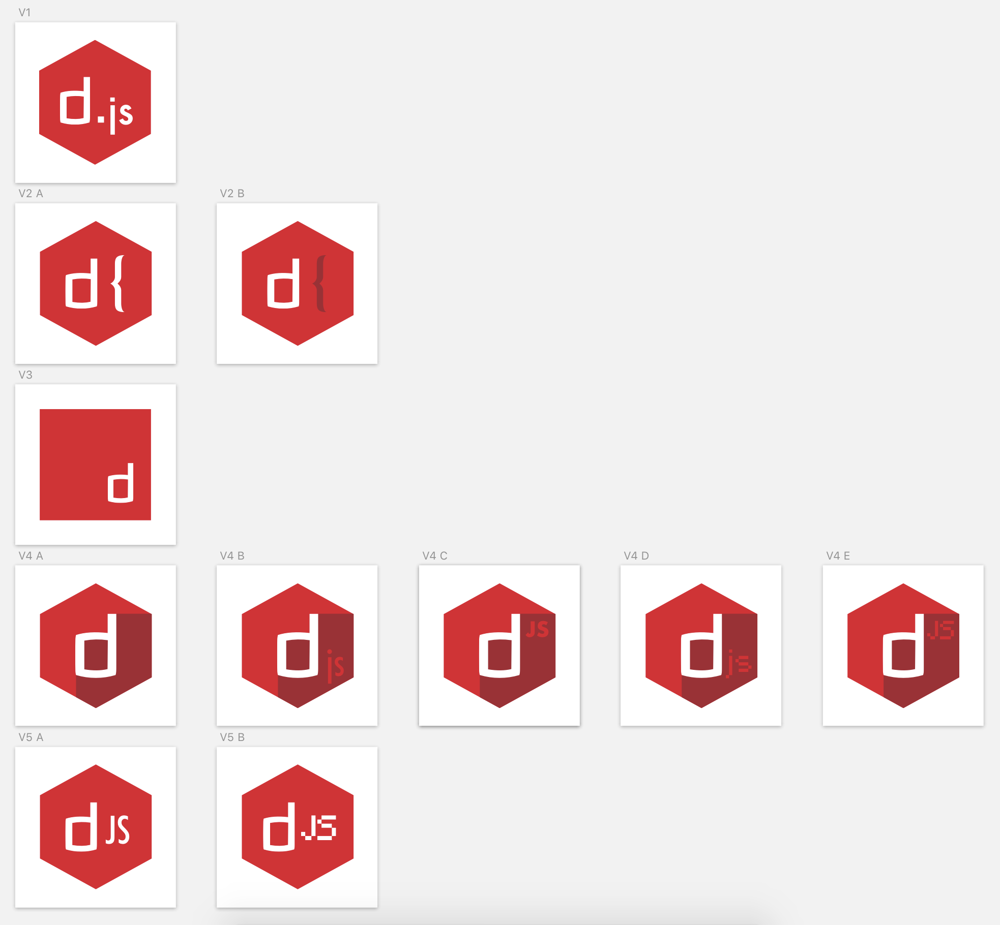

# Day 3

Today I worked on an original logo design for Digia's JavaScript tribe.

The tribe is a JavaScript-related club within a company so I figured I could borrow ideas from both JavaScript and the company to create an amalgamation of sorts.

I decided to go with two container options that would give the overall look and feel of the design: the hexagonal shape (fig. V1) used in the official Node logo, and a plain square (fig. V3) which is commonly seen in JavaScript icons.

To follow corporate branding specifications, I filled the container with Digia's bright red color, and traced Digia's initial letter with the vector tool.

Finally, I experimented with decorative features and sprinkled some JavaScript on the canvas.

