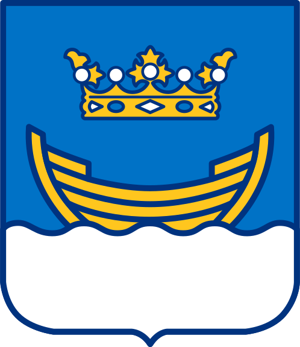
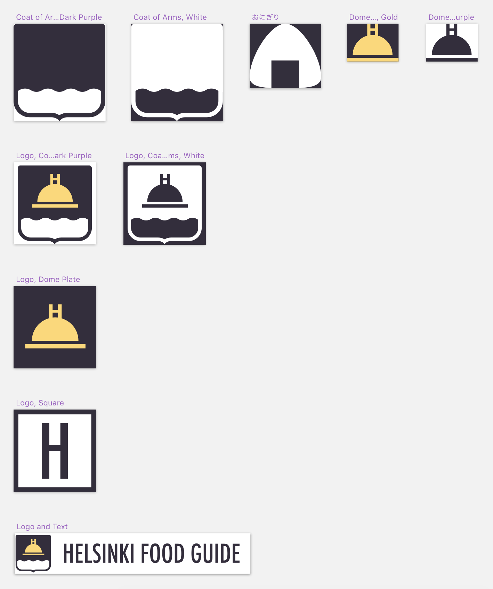
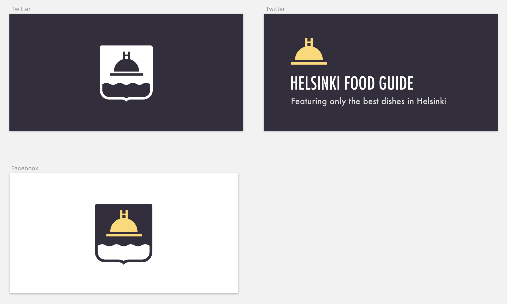

# Day 5

https://helsinkifoodguide.com

## Themes

- Food
- Reviews
- Helsinki
- Restaurant menus

## Related things

- Utensils
- Plates, bowls
- Kitchen
- Chef's hat
- Ingredients: Meats, vegetables
- Salt and pepper shakers
- BBQ
- Dishes: Pizza, bowl of rice, onigiri
- Wine
- Pots and cauldrons
- Campfire

## Influences

## Variations

