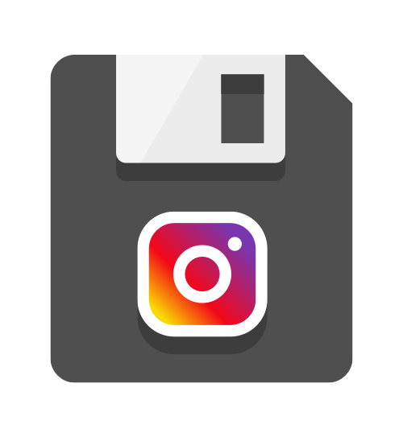

# Day 12

One of my original motivations for starting this project was to test myself whether I would be able to design adequate-looking logos for my personal projects. When I work on side projects, it brings me great satisfaction to design and implement every aspect of the software on my own.

Logo design was the last piece that was missing from my skill set, so I'm glad that I took up the challenge because it enabled me to become more comfortable with the craft as an amateur practitioner.

## On creativity

Creativity in logo design is the ability to take an idea and turn it into a meaningful picture. In my opinion, a good logo should try to accurately portray the idea with as little visual complexity as possible.

Usually, the fewer reference materials you have at your disposal, the more creative effort it takes to conceptualize and develop the visual elements of a logo (colors, shapes, tone, etc.) Creating a logo from scratch requires that you invest your own time and brain power in figuring out what works.

Recreating existing logos, on the other hand, takes the least amount of creative effort because everything has already been laid out for you, and you only need to figure out how to technically mimic the visual elements.

Despite these assumptions, after having worked on several different logo concepts, I've come to realize that some ideas happen to be easier to work with than others. There are things that just "click" for you faster and others that require significantly more time to develop.

## Challenges

The most notable challenge I had was a condition akin to the writer's block where I was stuck on a concept and unable to progress. Under such circumstances, the most effective remedy was to scrap everything and start afresh.

Dissatisfaction was also an issue. Some variations I produced were less than satisfactory which was discouraging especially early on.

In both situations the best overall solution was to focus on quantity. Sometimes this would allow me to produce a reasonable variation that I could develop further.

## Thoughts on tools

[Sketch](https://www.sketchapp.com) is excellent for its light weight and the streamlined tools that it provides. Most of the time I would only use a handful of tools for drawing.

Here are the tools that I found myself using probably more than 80% of the time:

- Rectangle
- Oval
- Text
- Vector (for drawing custom shapes and fine-tuning shapes)
- Subtract (for slicing off parts of a shape)
- Rotate
- Group (for organization and readability)
- Symbol (for creating reusable objects)
- Scale (also scales effects like borders and shadows)
- Hold down shift to center various anchor points or to align things evenly
- Distribute layers horizontally
- Align layer to center

## Tips for beginners

1. Focus on creating logos and less on technical things. Technical skill should be a byproduct of logo creation, not the other way around.
2. Create many variations and pick your favorites. Develop and polish the best ones.
3. Choose the right shade of color. Some shades look better than others.
4. Sleep on your designs and look at them with a fresh pair of eyes. They will look different tomorrow.
5. Usually, visual complexity makes a logo worse.
6. Zoom out. Would your logo make sense as a website's favicon? If not, try to eliminate certain parts and make other parts more prominent.
7. Use Google Images for inspiration. Emulate other designers.

## Personal favorites

